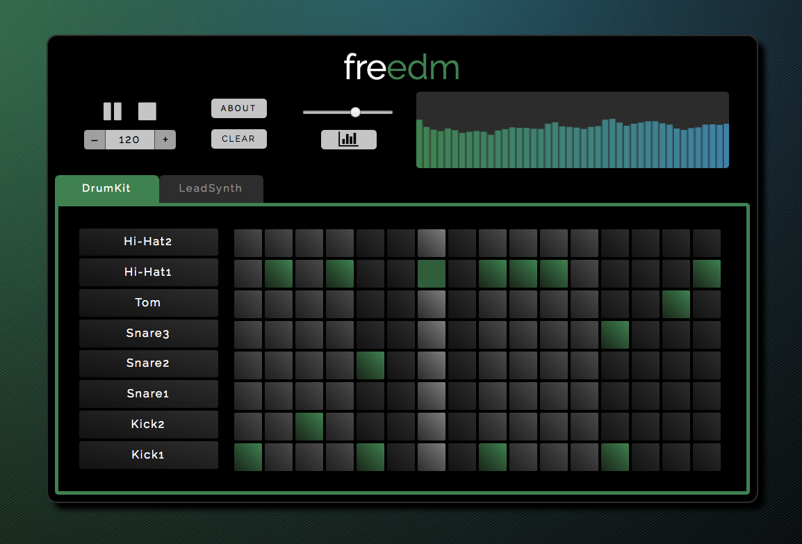

# Freedm

Freedm is a dynamic music sequencer app created by [Eric Kwok](https://github.com/kwokeric) and [Caleb Ontiveros](https://github.com/calebomusic).

[Live](https://calebomusic.github.io/freedm/index.html)



## Features

- Plays looping sounds
- Complete playback control with buttons for toggling play, pause and stop
- BPM, tempo, and volume adjustment
- Dynamic visualizer
- Intuitive UI with separate tabs for creating drum and melody loops

## Technologies and Implementation

Freedm is built with React and Redux. We incorporate Howler.JS for sound playback and the Web Audio API with canvas to render the dynamic music visualizer.

Below we cover the general application state, the visualizer, and the playback and tab components.

### Application State

Following Redux principles, there is a single store or application state that serves as the single source of truth. An example application state is:

```javascript
{
  bpm: 125,
  column: 0,
  instruments: [
      {
        name: "DrumKit1",
        startRow: 1
      },
      {
        name: "LeadSynth1",
        startRow: 8
      }
    ],
  playback: false,
  selectedSounds: {
      1: {
        1: false,
        2: false,
        3: true,
        4: false
        ...
      }
      2: Object,
      3: Object,
      4: Object,
      ...
    },
    volume: 0.7
  }
```

Application state then holds everything necessary for a functional sequencer: bpm, the current column, instruments, playback, selected sounds, and volume.

### Visualizer

The visualizer setup required creating a canvas element and utilizing the Web Audio API with Howler.js library.

To extract data from the audio source - a master Howler object that combines individual Howler sounds - we first created an analyser node in the Howler Web Audio context using the `createAnalyser()` method.
```JavaScript
this.analyser = Howler.ctx.createAnalyser();
```
This master Howler audio source is then connected to the analyzer via the `connect()` method:
```JavaScript
Howler.masterGain.connect(this.analyser);
```
Finally the masterGain node is directly connected to the destination node:
```JavaScript
this.analyser.connect(Howler.ctx.destination);
```
After creating an analyser with Howler.js we create a `dataArray` array to iterate through while drawing the bars. The fast Fourier transform (FFT) converts a signal from its original domain (in this case, sound waves) to a representation in the frequency domain. It is assigned the default value of 256. `this.bufferLength` is assigned the `frequencyBinCount` (the number of data values we used for the visualization). The data array is then created from `this.bufferLength`:
```JavaScript
this.analyser.fftSize = 256;
this.bufferLength = this.analyser.frequencyBinCount;
this.dataArray = new Uint8Array(this.bufferLength);
```

The `draw` method of the visualizer component renders the visualizer on the canvas utilizing `dataArray`. If the visualizer is turned on, the `dataArray` array determines the height and color of the bars.

```JavaScript
draw() {
  this.canvasCtx.clearRect(0, 0, this.WIDTH, this.HEIGHT);

  if (this.state.visualizer) {
    const drawVisual = requestAnimationFrame(this.draw);
  } else {
    this.canvasCtx.fillStyle = 'rgb(50, 50, 50)';
    this.canvasCtx.fillRect(0, 0, this.WIDTH, this.HEIGHT);
    return;
  }

  this.analyser.getByteFrequencyData(this.dataArray);

  this.canvasCtx.fillStyle = 'rgb(50, 50, 50)';
  this.canvasCtx.fillRect(0, 0, this.WIDTH, this.HEIGHT);

  let barWidth = (this.WIDTH / this.bufferLength) * 2.5;
  let barHeight;
  let x = 0;

  for(let i = 3; i < this.bufferLength; i++) {
    barHeight = this.dataArray[i];
    this.canvasCtx.fillStyle = `rgb(72, 141, ${(85 + (i * 2))})`;

    this.canvasCtx.fillRect(x,this.HEIGHT-barHeight/2,barWidth,barHeight/2);

    x += barWidth + 1;
  }
}
```

### Playback

The primary functionality of the app, playback, logic is handled by an individual React `Playback` component. When the user presses play the `startPlayback` action is fired, setting the `playback` slice of state to true. Because `Playback` is connected to the `playback` slice of state the Redux lifecycle `componentWillReceiveProps` is fired. Crucially this function clears and then starts the `play` interval:

```javascript
window.clearInterval(this.play);
this.play = window.setInterval(this.step, newProps.bpm)
```

The `step` function is called as often as the bpm dictates. `step` calls `changeColumn`, which updates the current column, and `playSounds` which plays every selected sound as follows:

```javascript
playSounds() {
  for (let row = 1; row < this.maxStartRow + 8; row++) {
    if (this.props.selectedSounds[row][this.props.column]) {
      let instrumentIdx = Math.floor(row / 8);
      let soundRow = (row % 8 === 0) ? 8 : (row % 8);

      if (row % 8 === 0) {
        instrumentIdx = Math.floor(row / 8) - 1;
      }

      let instrumentName = this.props.instruments[instrumentIdx].name;

      Instruments[instrumentName][soundRow].play();
    }
  }
}
```

The `selectedSounds` slice of state contains the information about which sounds to play at which column. The first key of the object represents the row, the second key the column, and the value convey whether that sound is selected or not. Thus structure of the object mirrors the structure of the cells displayed on the browser. Hence if `this.props.selectedSounds[row][this.props.column]`, the sound at that row and column is selected and should be played.

The `Instruments` constant contains instrument names which serve as keys to the HowerlerJS objects of that instrument. These objects receive the `play` method when they are selected. `soundRow` is calculated by modding by 8 in order to allow the app to incorporate different instruments, in different orders, and avoiding hard coding.

## Future Features
We plan to add to this app by implementing the following features:

##### Instrument Swapping
- Adding the ability to swap additional drum kits and synthesizers

##### More Music & Scrolling
- Adding additional bars and seamlessly scroll through the bars in time with the bpm.
